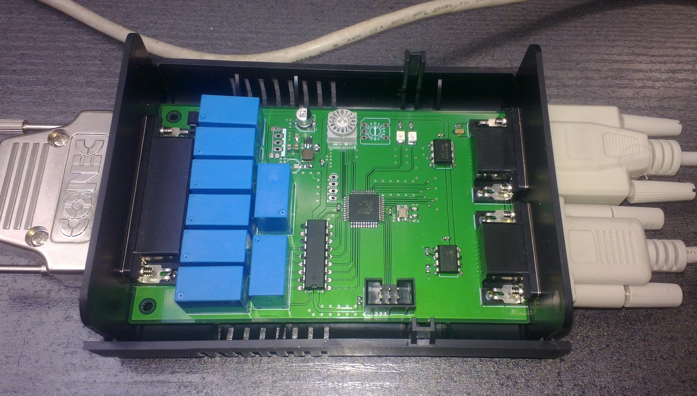

# TallyRelayBox
RS-422 Tally relay box using the TSL protocol

## Tally?

In broadcast the "red on air lamps" on cameras, monitors etc are called "Tally". They are one of the most basic and important means of communications in a studio.
Telling both the talent(s) and the technical crew (camera operators, director, etc) which image is on air (or about to be on air next).
This hardware design is a small project that fits into this niche by extracting eight channels of tally information from an RS-422/485 link carrying TSL UMD data. 
TSL's UMD protocol is one of the de-acto standards in "the industry" when it comes to distributing UMD - under monitor display - information (see tslproducts.com) 
with several other manufacturer's rack mount monitors or multy viewers understanding it.

This UMD data can easily be generated by a PC from your video mixer software (say OBS) or by writing an adapter application to translate your hardware mixer's protocol 
to TSL if the data link is not already using this protocol anyways.

The protocol obviously could be changed to whatever you feel is appropiate. Pull requests are welcome.

## Hardware

This design is based on a ATMega324PB.

Power supply can be in the range of 8 to 24V (change relays to your operating voltage!)

## Component sourcing

Most components in this design are widely available standard parts (Mouser etc are your friends for the switchmode regulator and inductor).
If used at 12V a 7805 linear regulator can be fitted as an alternative.
The provided CAD data allows easy adaption to your
local or preferred supplier. The board can be edited in the eagle freeware version if it is shortened by a few millimeters.
Current board size is designed to fit into a cheap plastic enclosure available from Reichelt Electronik in Germany 
(https://www.reichelt.de/kleingehaeuse-135-x-95-x-45-mm-eurobox-sw-p50429.html?&nbc=1). Similar enclosures should be readily available
from several suppliers. The relays used can either be TE  OJE-SS-112LMH or other types with a compatible footprint (like SonChuan 307 series).

## Compiling and flashing

I use avr-gcc 10.2.0 with GNU make on Linux for compiling this project. Your build environment may vary.
You may have to source the device definitions for the Mega324PB from Microchip to be able to compile this project.

See setup_fuses.sh for the fuse setting of the controller.
